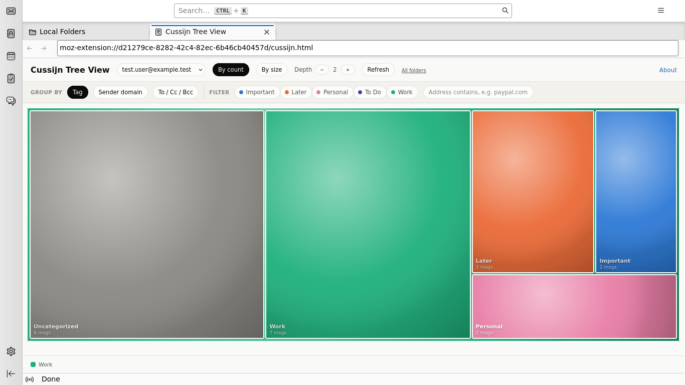

# Cussijn Tree View


A [SequoiaView](https://en.wikipedia.org/wiki/SequoiaView)-style treemap
of your mailbox: each folder is a rectangle sized by message count (or
size), colored by whichever mail tag is most common in it. Hover a
folder to see its full breakdown; click it to drill in, the way real
SequoiaView drills a directory into its actual subdirectories.

The name is a small wink: "cussijn" is an archaic Dutch spelling of
"cushion," a nod to **cushion treemaps** (van Wijk & van de Wetering,
1999, TU Eindhoven) - the shading technique that made SequoiaView (from
that same research group) visually distinctive. This extension's
squarified treemap layout is the other half of that same lineage
(Bruls, Huizing & van Wijk, 2000).

This is a **fully standalone** extension - no other add-on, no native
host, no companion process required. It only reads mail headers and
tags via Thunderbird's own `messenger.accounts`/`messenger.messages`
APIs and never opens a network connection.



A real screenshot, not a mockup: captured from the actual extension
running in a real, headless Thunderbird against entirely synthetic mail
(fake senders, `*.test` domains) - see `e2e/screenshot.sh` /
`e2e/README.md`'s "Mail fixture data" for how it's generated.

## Install

There's no native-messaging host to set up - just the add-on itself:

1. Build (or download) `cussijn-tree-view.xpi` - see "Build & test" below.
2. In Thunderbird: **Menu -> Add-ons and Themes** (Ctrl+Shift+A) -> gear
   icon -> **Install Add-on From File...** -> pick the `.xpi`.

## Opening it

Three ways in, all landing on the same view:

- **A keyboard shortcut** - `Ctrl+Shift+Y` by default, remappable in
  Add-ons Manager's gear menu -> **Manage Extension Shortcuts**.
- **Tools menu -> "Cussijn Tree View."**
- **Right-click a folder in the folder pane -> "Open in Cussijn Tree
  View"** - opens already drilled all the way down to that folder
  (walking the real breadcrumb to get there) instead of the full
  "All folders" level.

(There's no supported way for a Thunderbird WebExtension to add an entry
to the application's native **View** menu itself - checked against
Thunderbird's own menus documentation, whose list of places an extension
can add a menu item includes Tools but not View. The keyboard shortcut,
the Tools menu entry, and the folder-pane context menu entry are the
real equivalents the platform offers, and this extension uses all
three.)

## Using it

- **By count / By size** toggles what a rectangle's area represents.
- **Group by** switches what determines a rectangle's *color* -
  **Tag**, **Sender domain** (each domain gets its own automatically
  and stably assigned color, not re-randomized every time you open it),
  **To / Cc / Bcc** (how you personally were addressed on each message,
  using your account's own identity addresses), or **Year** (drills one
  extra level into **Month** before continuing to sender).
- **Filter**: tag chips are OR'd together (pick several tags, match
  any of them); the address box matches a domain or address anywhere
  in From, To, Cc, or Bcc - so filtering by `paypal.com` catches it
  whether PayPal is the sender or just Cc'd; **Hide sent by me** drops
  your own replies (useful on Gmail, where "All Mail" includes sent
  mail by IMAP definition, not just what you received). All active
  filters combine with AND. **Clear** resets them all.
- **Hover** a rectangle for its exact message count, size, and a
  breakdown of whichever dimension is currently grouping the view (or,
  for a single email, its sender/date/size).
- **Depth** controls how many of those levels are visible **at once**,
  nested inside each other, the way real SequoiaView shows several
  levels of a directory tree in one picture instead of forcing a click
  per level:
  1. A **folder with real subfolders** nests those actual subfolders
     inside it - exactly the account's own folder-pane nesting. A
     folder's size and color already reflect everything inside its
     whole subtree (like a disk-usage view, where a directory's size
     includes its subdirectories'), so you see the full picture at a
     glance. A folder with both real subfolders **and** its own direct
     messages shows one extra "(direct in this folder)" cell alongside
     them, so neither is hidden inside the other.
  2. Inside a folder with no more real subfolders (or that synthetic
     "direct in this folder" cell), the next level nests whatever
     **Group by** is currently set to - e.g. its real mix of sender
     domains (PayPal's own, plus whatever else ended up in there) if
     grouped by domain.
  3. Inside that: **senders**.
  4. Inside that: **individual emails** - the actual bottom of the
     data, one cell per message, colored by its own sender and named by
     its subject in the tooltip. Unlike the levels above, this one is
     never auto-expanded by Depth - a sender's messages are all the same
     size, so nesting hundreds of them inline just produces one huge
     featureless "(N more)" block; click into a sender to see its
     messages instead.

  A cell with its own nested children keeps a slim header labeling
  itself (with its own `▸` mark - clicking it still drills into just
  that one node) rather than the normal bottom label; a cell that looks
  flat but could still be drilled further (Depth too low, too small, or
  its color happens to match its next level's dominant one) gets the
  same `▸` mark near its own corner as a hint. A very large group
  (hundreds of senders or domains) folds its smallest entries into one
  "(N more)" cell rather than drawing hundreds of slivers - individual
  messages fold much sooner than other dimensions, since a wall of
  same-size message tiles adds little past the first few dozen. "Max"
  jumps Depth straight to its highest useful value in one click.

  **Click** any cell, at any depth, to drill the *whole view* one step
  further in - starting from that cell instead of "All folders," and
  nesting up to `Depth` levels below IT. The breadcrumb at the top shows
  the real path you've drilled - actual folder names first, then the
  content breakdown - and lets you climb back to any level; switching
  account or filters starts back over at the folder level, but
  switching Group by doesn't - it just recolors/regroups whatever
  you're already looking at (Depth doesn't reset either way).
- **Right-click any rectangle** (or the small circular button that
  appears on hovering one) to open a real Thunderbird tab filtered down
  to exactly what that rectangle represents - a live quick filter
  (`mailTabs.setQuickFilter`), narrowed by whichever cell you picked (a
  folder, a tag, a domain, a sender...). Reuses one tab rather than
  piling up new ones on repeated clicks. Right-click works even on a
  cell whose children are currently nested inside it (where the hover
  button would be hidden) - it's the one way to jump straight to a
  container cell's own search without drilling into it first.
- **Refresh** re-reads the current account; the account picker switches
  between your configured Thunderbird accounts.

Two honest limitations, both because Thunderbird's own quick filter API
just doesn't have the matching facet: it has no CC-only match, only a
combined "recipients" (To+Cc+Bcc), so the address filter and the "jump
to search" it opens can't isolate CC specifically from To or Bcc; and
it has no date/age match, so jumping to search from a Year, Month, or
To/Cc/Bcc cell (or with "Hide sent by me" active) can't narrow the
search beyond whatever tag/address filter is already active.

## Build & test

A podman-based pipeline - no Node or other tooling needed on the host,
just `podman`:

```
./build/run.sh
```

Lints and unit-tests the pure-logic pieces that are actually worth
testing (the real folder-tree drill-down, tag/domain aggregation,
recursive content-dimension grouping down to individual messages, the
squarified treemap layout - see `extension/cussijn.test.js`), then
packages `extension/` into `dist/cussijn-tree-view.xpi`.

**On that coverage badge**: it's generated by CI (`.github/workflows/ci.yml`,
`node --test --experimental-test-coverage`) on every push to `main` and
published to a separate, unprotected `badges` branch as a small JSON
file the badge itself reads live - no manual refreshing, it can't go
stale. It does need context to not be misread, though: it's whole-file
line coverage of `cussijn.js`, which mixes the pure logic above (fully
covered) with `initUi()`'s DOM wiring and the real `messenger.*` calls,
deliberately **not** unit-tested - they need a live Thunderbird to
exercise meaningfully, which is what `e2e/` is for instead (see
"End-to-end testing" below). That untested-by-design block is most of
what drags the line-coverage number down; it isn't a gap in the
pure-logic tests themselves.

### End-to-end testing against a real Thunderbird

Firefox can't run this extension at all (no `messenger.*` namespace), so
`e2e/` builds the real, packaged `.xpi` and installs it into a real,
headless Thunderbird, driven over
[Marionette](https://firefox-source-docs.mozilla.org/testing/marionette/index.html)
by a [Robot Framework](https://robotframework.org/) smoke suite:

```
./e2e/run.sh
```

It's a load-time smoke test, not a full interaction test - see
`e2e/README.md` for exactly what's verified and a documented, real
limitation (not just an unwritten TODO) on reaching into the page's own
DOM from here.

## Continuous integration & releases

- **CI** (`.github/workflows/ci.yml`) builds and unit-tests every push to
  `main` and every pull request, the same `build/build.sh` steps
  `./build/run.sh` runs locally.
- **Versioning is automated via `.github/workflows/release.yml`** - no
  Conventional Commits vocabulary anywhere in this repo's own process,
  and no stored credential beyond the built-in `GITHUB_TOKEN` (a
  personal-access-token-based, fully hands-off design was tried and
  deliberately dropped - a PAT with write access to the repo living in
  Actions secrets is a real thing to be cautious about, not a call to
  overrule). Mark a PR with what it should bump: either a GitHub label -
  **`major`**, **`minor`**, or **`bugfix`** - or its title starting with
  `major:`/`minor:`/`bugfix:` (label wins if both are present). Merging
  it computes the next `vX.Y.Z` from the latest tag and opens a small
  `release/vX.Y.Z` PR bumping `extension/manifest.json`'s `version` and
  adding a `CHANGELOG.md` entry - **you merge that PR yourself when
  ready**; that's the one deliberate manual step, and it's also what
  actually tags the repo and publishes a GitHub Release (see the comment
  at the top of `release.yml` for why merging it can't be automated
  without either that PAT or a GitHub anti-recursion limitation getting
  in the way). GitHub sometimes holds that PR's own CI run for manual
  "action_required" approval too, since it's opened by
  `github-actions[bot]` - approve it from the Actions tab same as
  reviewing the PR itself. A PR with none of major/minor/bugfix on it
  (docs, CI tweaks, a Dependabot bump) merges normally and cuts no
  release.
- **Publishing a GitHub Release** triggers
  `.github/workflows/publish-thunderbird.yml`, which builds the `.xpi`,
  attaches it to the release, and signs + submits it to
  [addons.thunderbird.net](https://addons.thunderbird.net) (ATN) for
  review via [web-ext](https://github.com/mozilla/web-ext).
- **Dependabot** (`.github/dependabot.yml`) watches the two things this
  repo actually has versions to bump - the GitHub Actions used by these
  workflows, and the `node:20-slim` base image in
  `build/Containerfile` - grouping each into one weekly PR. Those PRs
  auto-merge (squash) once CI passes, via
  `.github/workflows/dependabot-auto-merge.yml`.

### Code quality (SonarQube Cloud)

`.github/workflows/sonar.yml` scans `extension/` on every push to `main`
and every pull request, using `sonar-project.properties`. It's a separate
workflow from `ci.yml` and isn't a required check, so it can't block a
merge. Until the token below exists (and on fork/Dependabot PRs, where
GitHub withholds secrets) it skips itself and passes.

One-time setup, which only you can do:

1. Sign in at [sonarcloud.io](https://sonarcloud.io) with GitHub and import
   this repo. The free tier covers public repos.
2. In the project's **Administration -> Analysis Method**, turn off
   **Automatic Analysis** - it can't run alongside the CI scan.
3. Check that the organization and project key shown there match
   `sonar.organization` and `sonar.projectKey` in `sonar-project.properties`.
4. Generate a token (**My Account -> Security**) and add it as the repo
   Actions secret `SONAR_TOKEN`.

Unit-test coverage isn't sent to Sonar yet: CI runs Node 20, whose test
runner has no lcov output.

### Publishing to Thunderbird Add-ons

The automated submission needs an ATN developer account and API
credentials that only you can create - this repo's pipeline can't do
that part for you:

1. Sign in at [addons.thunderbird.net](https://addons.thunderbird.net)
   and open your developer account's API keys page.
2. Generate an API key/secret pair.
3. Add them to this repo as Actions secrets named `ATN_API_KEY` and
   `ATN_API_SECRET` (**Settings -> Secrets and variables -> Actions**).

Confirmed working end to end on this repo's actual v1.0.0 release: the
`.xpi` uploaded, validated, and was auto-signed by ATN within a couple
of minutes, with no manual step needed - the `web-ext` CLI's own
"doesn't have signing enabled" warning during the upload turned out to
just mean it doesn't wait around for that async result, not that
signing itself didn't happen.

**One required one-time step, confirmed by a real failure on v1.0.1**:
ATN accepted a brand-new listing's first version via the API with no
complaints, but rejected the second with `You cannot add a listed
version to this addon via the API due to missing metadata. Please
submit via the website`. Before your second release, fill in the
add-on's **Description** on the ATN Developer Hub yourself (your
listing's page -> Add-on Details -> Edit) - this is addon-level
metadata, not something any manifest key or API call sets, so the
pipeline can't do it for you. One-time only; every release after that
should go through automatically.

## Privacy

This extension collects and transmits nothing. It calls only local
Thunderbird WebExtension APIs to read message headers/tags and add its
one folder-pane context menu entry, and never makes a network request.
See `extension/options.html` for the same statement inside the add-on
itself.

## Files

- `extension/manifest.json` - permissions (`accountsRead`,
  `accountsFolders`, `messagesRead`, `messagesTags`, `menus`, `storage` -
  all read-only, UI-only, or local-only, no `compose`/`messagesMove`/
  `messagesDelete`/`messagesUpdate` needed since this never changes
  anything; `storage` is `browser.storage.local` for a local per-account
  cache, nothing leaves the machine) and the `commands` keyboard
  shortcut declaration.
- `extension/background.js` - tiny: owns the keyboard shortcut, the
  Tools-menu entry, and the folder-pane context menu entry, all three
  opening/focusing the same Cussijn Tree View tab. No dispatch table -
  see `CLAUDE.md` for why.
- `extension/cussijn.html` / `cussijn.js` - the treemap itself: data
  loading, the real folder-tree drill-down, the squarified layout
  algorithm, rendering, hover.
- `extension/cussijn.test.js` - Node-run unit tests for the pure layout/
  aggregation functions.
- `extension/icons/icon.svg` - a rounded, tufted "cushion" silhouette
  with a small squarified treemap tiled inside it, each cell shaded with
  the same radial-highlight "bump" a real cushion treemap uses - the
  name and the algorithm, both drawn into the icon.
- `extension/options.html` - a short about page (no actual settings to
  configure).
- `build/` - the podman build/lint/test/package pipeline.
- `e2e/` - the podman Robot Framework smoke suite against a real
  headless Thunderbird over Marionette (`./e2e/run.sh`), synthetic mail
  fixture generation, and the README screenshot generator
  (`./e2e/screenshot.sh`).
- `docs/screenshot.png` - the README's screenshot, generated by
  `./e2e/screenshot.sh` - not hand-authored, regenerate it rather than
  editing it directly if it ever needs to change.
- `.github/workflows/` - CI, the `major`/`minor`/`bugfix` release
  workflow, the Thunderbird Add-ons publish workflow, and Dependabot
  auto-merge.
- `.github/dependabot.yml` - config for Dependabot grouping.
- `.github/ISSUE_TEMPLATE/` - structured bug report / feature request
  forms; blank issues stay allowed too for anything that fits neither.
- `CHANGELOG.md` - appended to automatically by `release.yml`.
